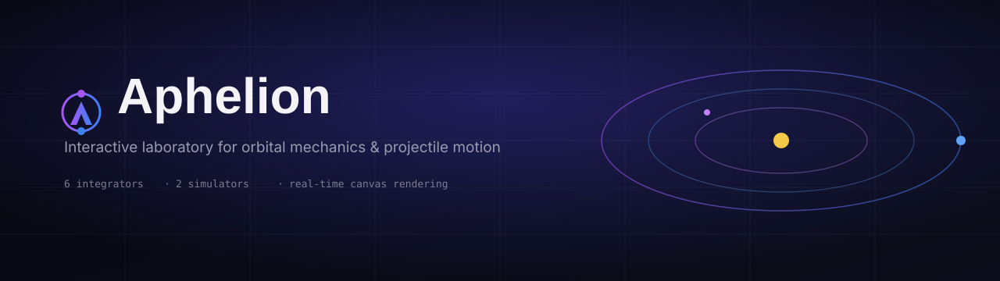
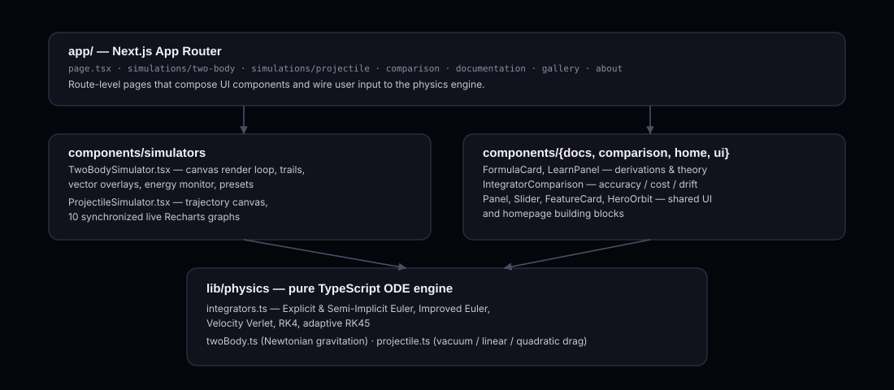

<div align="center">



<br/>


### Aphelion

**A research-grade, in-browser laboratory for classical mechanics — built to make physics intuitive for learners and competitors alike.**
Run the same orbit or the same projectile through six numerical integrators, side by side, and watch — in real time — where each one earns its keep and where it quietly falls apart.


</div>

---


## Overview

Aphelion is an interactive physics laboratory built with Next.js. Instead of *telling* you that Explicit Euler drifts and Velocity Verlet doesn't, it lets you launch the same two-body system through both integrators and watch a live energy-conservation monitor prove it. Every trajectory rendered on the site — from the homepage hero animation to the gallery thumbnails — is a genuine live simulation running the shared physics engine in [`lib/physics`](./lib/physics). Nothing is pre-rendered or faked; changing a parameter changes the numbers that come out, on every page, on every render tick.

The project has two halves that mirror each other:

1. **A pure, dependency-free TypeScript physics core** (`lib/physics`) — flat-array ODE integrators plus two physical models (Newtonian two-body gravitation, and projectile motion under vacuum/linear/quadratic drag). This layer knows nothing about React, canvas, or the DOM; it just takes a state vector and a `dt` and returns a new state vector.
2. **A React/Canvas presentation layer** (`components/simulators`, `components/comparison`, `components/gallery`) that drives that core on a `requestAnimationFrame` loop, renders it to `<canvas>`, and mirrors selected quantities into live Recharts graphs and numeric readouts.

<div align="center">

</div>

### Why Aphelion

Aphelion was built to make the mechanics topics that show up constantly in physics competitions and coursework — orbital motion, energy conservation, eccentricity, projectile range under drag — something you can *see change* instead of only solve on paper. That makes it useful as:

- **A competition-prep sandbox** — for Physics Olympiad, JEE/NEET-style mechanics, or any exam where two-body orbits and projectile motion with drag show up. Dial in a preset's initial conditions, watch the derived quantities (eccentricity, semi-major axis, orbital period, energy) update live, and build the intuition that turns a formula you've memorized into something you actually understand.
- **A numerical-methods teaching tool** — the Method Comparison Lab makes the abstract idea of integrator order and symplecticity concrete: you can watch a first-order method's energy visibly drift while a symplectic method's energy merely oscillates, on the same orbit, at the same time.
- **A self-check for hand-worked problems** — set up the same scenario you just solved analytically (e.g. a vacuum projectile, or a circular orbit's period from Kepler's third law) and compare it against the simulator's live readouts.

## Features

| | |
|---|---|
|   **Two-Body Gravitational Simulator** | Model circular, elliptical, hyperbolic, binary, and collision orbits under Newtonian gravity, with a live energy-conservation monitor, velocity/acceleration/force vector overlays, center-of-mass tracking, gravitational field lines, and predicted-orbit ghosting. |
|   **Projectile Motion Simulator** | Launch through vacuum, linear drag, or quadratic drag with configurable wind, mass, and elevation, backed by **10 synchronized live graphs** and an analytic vacuum-trajectory overlay for direct comparison. |
|   **6 Numerical Integrators** | Explicit Euler, Semi-Implicit (Symplectic) Euler, Improved Euler (Heun's method), Velocity Verlet, classical RK4, and adaptive RK45 (Dormand–Prince) — implemented from scratch in flat-array form and swappable mid-simulation. |
|   **Method Comparison Lab** | Batch-runs all five two-body-compatible integrators against the same preset and plots normalized energy error over time, alongside raw wall-clock timing per method. |
|   **Documentation & Derivations** | The equations, Butcher tableaus, and orbital-mechanics derivations behind every simulation, written out in full on the in-app `/documentation` route. |
|   **Gallery** | A curated set of live, running previews of interesting configurations — binaries, hyperbolic flybys, unstable close approaches, crosswind shots. |
|   **Fully Live Parameters** | Every slider, preset, and toggle re-drives the simulation in real time on an HTML5 canvas targeting 60fps — nothing here is a pre-baked animation, including the small preview cards in the gallery. |
|   **Collision Handling** | Configurable restitution in the two-body engine — from perfectly inelastic mergers (with correct momentum-conserving center-of-mass combination) to elastic bounces via impulse resolution along the line of centers. |
|   **Analytic Reference Overlays** | The projectile simulator can plot the closed-form vacuum solution alongside the numerically integrated one, so drag's effect on range and apex is visually obvious. |

## Tech Stack

<div align="center">

| Layer | Technology |
|---|---|
| Framework | [Next.js 16](https://nextjs.org/) (App Router), [React 19](https://react.dev/), [TypeScript 5](https://www.typescriptlang.org/) |
| Styling | [Tailwind CSS v4](https://tailwindcss.com/), [Fontsource](https://fontsource.org/) (Space Grotesk, Inter, JetBrains Mono) |
| Physics Engine | Custom TypeScript ODE solvers — Newtonian gravitation, drag & wind models, zero runtime dependencies |
| Visualization | HTML5 Canvas 2D, [Recharts](https://recharts.org/), `requestAnimationFrame` render loops |
| Icons / Motion | [lucide-react](https://lucide.dev/), [Framer Motion](https://www.framer.com/motion/) |
| Tooling | ESLint 9 (flat config), PostCSS, TypeScript strict mode |

</div>

## Getting Started

### Prerequisites

- **Node.js** 20 or later
- **npm** (or your package manager of choice — yarn/pnpm/bun all work; there's no server-side runtime dependency beyond Next.js itself)

### Installation

```bash
# Clone the repository
git clone https://github.com/<your-username>/Aphelion.git
cd Aphelion

# Install dependencies
npm install
```

### Run the development server

```bash
npm run dev
```

Open [http://localhost:3000](http://localhost:3000) to see the app. Pages hot-reload as you edit files under `app/`; the physics core has no build step of its own, so editing anything under `lib/physics` hot-reloads too.

### Production build

```bash
npm run build
npm run start
```

`next build` produces a standard Next.js production build; `next start` serves it. The app has no external API routes, database, or environment variables — it is entirely client-computed, so it deploys cleanly to Vercel, Netlify, or any Node hosting target with zero configuration.

### Lint

```bash
npm run lint
```

Runs ESLint 9 with the flat-config `eslint-config-next` ruleset defined in `eslint.config.mjs`.

## Project Structure

```
Aphelion/
├── app/                                # Next.js App Router pages
│   ├── page.tsx                         # Landing page: hero, stat blocks, feature cards
│   ├── layout.tsx                       # Root layout: fonts, <NavBar/>, <Footer/>
│   ├── globals.css                      # Design tokens (colors, grid-surface background, etc.)
│   ├── simulations/
│   │   ├── page.tsx                     # Simulator index / chooser
│   │   ├── two-body/page.tsx            # Two-body gravitational simulator page
│   │   └── projectile/page.tsx          # Projectile motion simulator page
│   ├── comparison/page.tsx              # Integrator comparison lab
│   ├── documentation/page.tsx           # Theory, derivations, Butcher tableaus
│   ├── gallery/page.tsx                 # Live simulation gallery
│   └── about/page.tsx                   # About page, tech stack, objectives
├── components/
│   ├── simulators/
│   │   ├── TwoBodySimulator.tsx         # Canvas render loop, trails, vector overlays,
│   │   │                                 # energy monitor, view-option toggles, presets
│   │   └── ProjectileSimulator.tsx      # Trajectory canvas + 10 synchronized Recharts graphs
│   ├── comparison/
│   │   └── IntegratorComparison.tsx     # Batch runner: energy-error-vs-time chart + timing table
│   ├── docs/
│   │   ├── FormulaCard.tsx              # Rendered equation blocks for the docs page
│   │   └── LearnPanel.tsx               # Expandable theory/explanation panels
│   ├── gallery/
│   │   └── MiniPreview.tsx              # Small, self-contained live canvas previews
│   ├── home/
│   │   ├── HeroOrbit.tsx                # Landing-page live orbit animation
│   │   ├── FeatureCard.tsx              # Feature grid cards
│   │   └── StatBlock.tsx                # Stat counters in the hero band
│   ├── layout/
│   │   ├── NavBar.tsx                   # Sticky nav with active-route highlighting
│   │   └── Footer.tsx
│   └── ui/
│       ├── Panel.tsx                    # Panel, Readout, Badge primitives
│       └── Slider.tsx                   # Slider, Segmented control primitives
├── lib/
│   └── physics/
│       ├── integrators.ts               # Generic flat-vector ODE integrators + IntegratorId/META
│       ├── twoBody.ts                   # Gravitational N=2 dynamics, collisions, presets
│       └── projectile.ts                # Drag/wind projectile dynamics, presets, analytic overlay
├── public/                              # Static assets (logo, favicon, default Next.js svgs)
├── docs/images/                         # README banner & architecture diagram assets
├── next.config.ts / tsconfig.json / postcss.config.mjs / eslint.config.mjs
└── package.json
```

## Simulators In Depth

###  Two-Body Gravitational Simulator

`components/simulators/TwoBodySimulator.tsx` drives `lib/physics/twoBody.ts` on a `requestAnimationFrame` loop and renders both bodies, their trails, and a set of optional overlays to `<canvas>`.

**Selectable integrators:** Velocity Verlet · Semi-Implicit Euler · RK4 · Adaptive RK45 · Explicit Euler

**View options (all toggleable live):**

| Toggle | Effect |
|---|---|
| Trails | Fading path history for both bodies |
| Velocity vectors | Instantaneous velocity arrows |
| Acceleration vectors | Instantaneous acceleration (force ÷ mass) arrows |
| Force vectors | Gravitational force arrows on each body |
| Center of mass | Marks and optionally re-centers the view on the system barycenter |
| Focus | Camera follow mode |
| Grid | Reference grid overlay |
| Field lines | Approximate gravitational field-line visualization |
| Predicted orbit | Ghosted forward projection of the current trajectory |

**Built-in scenario presets** (`TWO_BODY_PRESETS`):

| Preset | Description |
|---|---|
| Circular Orbit | Equal-ish masses on a near-perfect circular orbit around their common center of mass |
| Elliptical Orbit | A moderately eccentric ellipse — speeds up sharply at perihelion, the classic Kepler picture |
| Hyperbolic Flyby | The smaller body arrives too fast to be captured and slingshots away on an open trajectory |
| Comparable-Mass Binary | Two similar masses orbiting a shared center of mass well away from either body |
| Collision Course | Two bodies aimed directly at each other — watch merging or elastic bounce in action |
| Unstable Close Approach | A grazing, highly eccentric orbit that dips extremely close to the primary — a stress test for every integrator |

**Live telemetry (21 readouts)** derived every frame by `deriveQuantities()`: position/velocity/acceleration for both bodies, separation, relative speed, center-of-mass position & velocity, kinetic/potential/total energy, relative angular momentum, eccentricity, semi-major axis, orbital period, escape velocity, and classified orbit type (`circular` / `elliptical` / `parabolic` / `hyperbolic` / `collision`).

**Collisions** are optional and physically resolved rather than merely visual: bodies with `restitution ≈ 0` merge into a single momentum-conserving mass at the combined center of mass; bodies with `restitution > 0` bounce via an impulse computed along the line of centers, scaled by the restitution coefficient — a real (if simplified) contact model, not a scripted animation.

### 🌊 Projectile Motion Simulator

`components/simulators/ProjectileSimulator.tsx` drives `lib/physics/projectile.ts`, rendering the trajectory to canvas alongside **10 synchronized live graphs** (height, range, speed, kinetic/potential/total energy, drag force magnitude, acceleration components, etc.), each updating in lock-step with the simulation clock.

**Selectable integrators:** RK4 · Explicit Euler · Improved Euler (Heun) · Adaptive RK45

**Drag models:**

| Model | Behavior |
|---|---|
| `vacuum` | No air resistance — the textbook parabola |
| `linear` | Drag force proportional to velocity, `F = −k·v` (viscous / low-Reynolds-number regime) |
| `quadratic` | Drag force proportional to velocity squared, `F = −½·ρ·Cd·A·|v|·v` (typical for macroscopic projectiles) |

Wind is modeled as a constant vector added into the relative-velocity term feeding the drag calculation, so the drag force always acts opposite the projectile's velocity *relative to the moving air*, not its ground velocity.

**Built-in scenario presets** (`PROJECTILE_PRESETS`): Textbook Vacuum, Cannonball with Quadratic Drag, Crosswind Shot, and Cliff Launch with Linear Drag — each tuned to make its governing effect (drag magnitude, wind, launch height) visually obvious against the analytic vacuum overlay.

The simulator also exposes `vacuumTrajectory()`, a closed-form analytic solution, as a reference overlay — so the visual gap between "the equation you learn in class" and "what actually happens with real air resistance" is directly on screen.

## Physics Engine

All physics code lives in [`lib/physics`](./lib/physics) and has **zero runtime dependencies** — it's plain TypeScript operating on `number[]` state vectors, so it is trivially unit-testable and reusable outside of React.

### Numerical Integrators

Defined in [`lib/physics/integrators.ts`](./lib/physics/integrators.ts), every integrator shares the signature `(y, f, t, dt) → { y, dtUsed, error?, rejected? }` where `f` is a derivative function `(y, t) → dy/dt`.

| Method | Order | Symplectic | Adaptive | Notes |
|---|:---:|:---:|:---:|---|
| **Explicit (Forward) Euler** | 1 | ✗ | ✗ | Simplest possible method; included as a cautionary baseline. Energy drifts visibly within a few orbits. |
| **Semi-Implicit Euler** | 1 | ✓ | ✗ | Updates velocity with the current acceleration *then* updates position with the new velocity. Energy oscillates but does not drift over long runs. |
| **Improved Euler (Heun's method)** | 2 | ✗ | ✗ | Predictor–corrector: averages the derivative at the start and predicted end of the step. |
| **Velocity Verlet** | 2 | ✓ | ✗ | Symplectic and time-reversible; the standard choice for N-body gravitational integration. |
| **Classical RK4** | 4 | ✗ | ✗ | Four-stage Runge–Kutta; very precise short-term, but slow secular energy drift appears over long integrations since it isn't symplectic. |
| **Adaptive RK45 (Dormand–Prince)** | 5 | ✗ | ✓ | Full 7-stage embedded Dormand–Prince pair (the same tableau behind MATLAB's `ode45`), with local error estimated against a configurable tolerance (default `1e-6`) and a PI-style step-size controller. |

Each method's metadata (label, order, symplectic/adaptive flags, human-readable description) is centralized in `INTEGRATOR_META`, which both the simulator UIs and the documentation page read from — add an integrator once, and its description is consistent everywhere it's referenced.

### Two-Body Dynamics

`lib/physics/twoBody.ts` integrates the flat 8-component state `[x1, y1, vx1, vy1, x2, y2, vx2, vy2]` under mutual Newtonian gravitation:

```
F = G·m₁·m₂ / (r² + ε²)      (ε = Plummer softening length, avoids a singular force as r → 0)
```

From the raw state, `deriveQuantities()` computes the full reduced two-body solution each frame: relative angular momentum, the Laplace–Runge–Lenz eccentricity vector, specific orbital energy, semi-major axis, orbital period (via Kepler's third law, when bound), and escape velocity — then classifies the orbit as circular / elliptical / parabolic / hyperbolic purely from the sign and magnitude of the specific orbital energy, not from a lookup table.

### Projectile Dynamics

`lib/physics/projectile.ts` integrates the flat 4-component state `[x, y, vx, vy]` under gravity plus an optional drag term evaluated against velocity *relative to a configurable wind vector*, supporting the vacuum / linear / quadratic drag models described [above](#-projectile-motion-simulator). Landing is detected and the final step is linearly interpolated back to `y = 0` so the trajectory doesn't visibly plunge through the ground on a coarse timestep.

## Method Comparison Lab

`components/comparison/IntegratorComparison.tsx` batch-runs Explicit Euler, Semi-Implicit Euler, Velocity Verlet, RK4, and RK45 against the **same** two-body preset and fixed step count/`dt`, tracking:

- **Normalized energy error over time** — `|E(t) − E(0)| / |E(0)| × 100%`, sampled every 10 steps and plotted per method on a shared timeline, so symplectic drift-free methods and non-symplectic drifting methods are visible on one chart.
- **Wall-clock timing per method** — measured with `performance.now()` around the full batch run, giving a rough relative cost comparison alongside the accuracy picture.

Switching the preset re-runs the full comparison against that scenario's parameters and initial conditions, so you can, for example, watch every method perform reasonably on a Circular Orbit and then diverge sharply on the Unstable Close Approach preset.

## Extending Aphelion

**Add a new integrator:**
1. Implement a function `(y, f, t, dt) => { y, dtUsed, error?, rejected? }` in `lib/physics/integrators.ts`.
2. Add its `IntegratorId` and an entry in `INTEGRATOR_META`.
3. Wire it into the `switch` in `stepTwoBody` and/or `stepProjectile`, and add it to the relevant simulator's method list.

**Add a new scenario preset:** append an entry to `TWO_BODY_PRESETS` or `PROJECTILE_PRESETS` with a `params` object and (for two-body) an `initial` state vector — it will automatically appear in the simulator's preset picker and in the Gallery.

**Add a new derived quantity:** extend `DerivedQuantities` / `ProjectileDerived` and compute it inside `deriveQuantities()` / `deriveProjectile()`; expose it via a `<Readout/>` in the simulator UI.

## Performance Notes

- Both simulators run their physics step and canvas draw inside a single `requestAnimationFrame` loop, targeting 60fps; heavier view options (field lines, dense trails) cost draw time, not simulation time.
- RK45's adaptive step size means it can take far fewer physics steps than a fixed-step method for the same visual smoothness — the Method Comparison Lab's timing table makes this trade-off directly measurable.
- The physics core allocates a fresh array per step rather than mutating in place, which is simple and correct but means very high step-rates (e.g. running many presets in the Gallery simultaneously) are GC-bound before they're CPU-bound — worth knowing if you extend the Gallery to render many more live previews at once.

## Browser Support

Aphelion targets modern evergreen browsers with Canvas 2D and ES2020 support (Chrome, Firefox, Safari, Edge — current and previous major versions). No polyfills are included; there is no IE11 support.

## Roadmap

- [ ] Three-body and N-body extensions
- [ ] Exportable simulation traces (CSV / JSON)
- [ ] Shareable permalinks for a given parameter set
- [ ] Additional integrators (e.g. Leapfrog, symplectic higher-order methods)
- [ ] Configurable RK45 tolerance exposed in the UI

## FAQ

**Is anything on this site pre-rendered or a canned animation?**
No. Every canvas you see — including the homepage hero and the small Gallery preview cards — runs the same `lib/physics` engine live, on your device, every frame.

**Why does Explicit Euler look "wrong" on long-running orbits?**
It isn't a bug — first-order, non-symplectic Euler genuinely does gain or lose energy over time. That visible drift is the entire pedagogical point of including it alongside Velocity Verlet and RK45; see [Numerical Integrators](#numerical-integrators).

**Can I use the physics engine outside of this app?**
Yes — `lib/physics` has no dependency on React, Next.js, or the DOM. It's plain TypeScript operating on `number[]` state vectors and can be imported into any TypeScript/JavaScript project.

**Does this require a backend or API keys?**
No. Everything runs client-side; there is no server component beyond what Next.js itself provides for routing and static asset serving.

## Contributing

Contributions are welcome. To propose a change:

1. Fork the repository and create a feature branch
2. Make your changes (`npm run lint` should pass)
3. Open a pull request describing the change and, where relevant, the physics or numerical-methods motivation behind it

## License

Distributed under the MIT License. See `LICENSE` for more information.

---

<div align="center">
<sub>Built to make physics easy for competitions .</sub>
</div>
